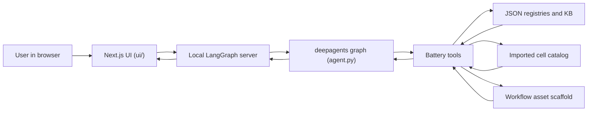

# Battery Lab Assistant

Battery Lab Assistant is a local, Windows-first battery workflow application for:

- registry-backed chemistry and method lookups
- protocol planning with controlled constraints
- imported commercial-cell reference lookup
- preflight QA and review-point assembly
- deterministic CSV analysis and KPI summaries
- inline tool cards and plots in a local chat UI

It is not a generic chatbot. The repository is intentionally organized so that hard values come from local registries, imported metadata, and tool outputs, while the language model is used to route, explain, and summarize.

## Documentation

- Companion public docs repo:
  `https://shiyunliu-battery.github.io/doc_batterylab.online/`
- Local architecture and workflow notes:
  [docs/](./docs)

## Framework And Stack

| Layer | Frameworks / Libraries | What It Does |
| --- | --- | --- |
| Agent runtime | `deepagents`, `LangGraph`, `langgraph-cli[inmem]` | Runs the graph server, tool orchestration, and subagent delegation |
| LLM integration | `LangChain`, `langchain-openai` | Connects the graph to the configured OpenAI chat model |
| Backend language | Python `3.12+` | Hosts tools, registries, planning logic, datasheet extraction, and domain services |
| Frontend | `Next.js 16`, `React 19`, `TypeScript` | Provides the local chat application |
| Frontend styling | `Tailwind CSS`, `Radix UI`, `lucide-react` | UI primitives, layout, icons, and styling |
| Frontend data layer | `@langchain/langgraph-sdk`, `SWR` | Connects the UI to the local LangGraph deployment |
| Workflow scaffold | starter preprocessing, reporting, DOE, and modeling registries | Documents future deterministic layers that remain parked or partial today |
| Data layer | local JSON registries, imported cell catalog, extracted PDF content, workflow asset scaffold | Defines controlled chemistry, method, QA, reporting, and future preprocessing context |
| Packaging | `uv`, `yarn` | Python and frontend dependency management |

## What The Project Does

The app is designed around a few narrow workflows:

1. Answer questions from controlled chemistry and method data.
2. Draft battery test plans from registry-backed templates and constraints.
3. Search imported commercial-cell metadata and carry it into planning flows.
4. Run deterministic starter analysis on cycle-level CSV data.
5. Generate structured markdown reports from protocol and analysis outputs.
6. Expose a backend asset scaffold so the lab can keep adding manuals, DOE templates, evidence cards, and preprocessing rules.

Workflow map and status:

- Public docs mirror:
  `https://shiyunliu-battery.github.io/doc_batterylab.online/`
- [docs/workflow_map.md](./docs/workflow_map.md)
- [docs/architecture.md](./docs/architecture.md)
- [docs/project_status.md](./docs/project_status.md)

## Architecture Overview



Request flow in practice:

1. The browser sends the message to the local LangGraph deployment.
2. The deep agent decides whether to answer directly or call tools.
3. Registry-backed tools load chemistry, method, equipment, or imported-cell context.
4. Planning tools merge controlled constraints with the user request.
5. Analysis and report tools convert CSV or structured outputs into review-ready summaries.
6. The frontend renders `ui_markdown` and structured tool payloads inside tool cards.

## State, Memory, And Persistence

This repo currently uses thread history, not a long-term learned memory layer.

- Local LangGraph dev state is persisted under [`.langgraph_api`](./.langgraph_api).
- Thread and checkpoint history are restored when the UI reopens an existing thread.
- There is no separate long-term preference memory store by default.
- Imported commercial-cell records are stored as local JSON, not in a remote database.
- LLM inference still depends on the configured OpenAI model.

## Repository Layout

```text
.
|-- agent.py
|-- langgraph.json
|-- pyproject.toml
|-- battery_agent/
|   |-- tools.py
|   |-- methods.py
|   |-- planning_context.py
|   |-- prompts.py
|   |-- registries.py
|   |-- workflow_assets.py
|   `-- cell_catalog.py
|-- data/
|   |-- registries/
|   |-- kb/
|   |-- methods/
|   |-- workflows/
|   `-- reference/cell_catalog/
|-- ui/
|   |-- package.json
|   `-- src/
|-- scripts/
|-- tests/
`-- README.md
```

## Backend Design

### Agent graph

- [agent.py](./agent.py) is the LangGraph entrypoint.
- It builds one main agent plus protocol and analysis subagents with `deepagents.create_deep_agent(...)`.
- The model is loaded through `langchain.chat_models.init_chat_model(...)`.
- The default model is controlled by `BATTERY_AGENT_MODEL` in `.env`.
- Uploaded cell-datasheet extraction is handled separately through the OpenAI Responses API and can be overridden with `BATTERY_AGENT_CELL_DATASHEET_EXTRACTION_MODEL`. If that variable is unset, it inherits `BATTERY_AGENT_MODEL` after stripping the `openai:` prefix when needed.

### Registry-first domain model

The backend separates "hard values" from "LLM narration":

- [data/registries/chemistry_registry.json](./data/registries/chemistry_registry.json)
  Chemistry constraints and defaults
- [data/registries/method_registry.json](./data/registries/method_registry.json)
  Method templates and required inputs
- [data/registries/lab_workflow_registry.json](./data/registries/lab_workflow_registry.json)
  Scaffold for preprocessing, reporting, DOE, manuals, provisional cells, and evidence assets

The language model should not invent voltage limits, method defaults, or equipment capabilities when structured data exists.

### Planning layer

- [battery_agent/methods.py](./battery_agent/methods.py) merges methods, chemistry constraints, and instrument inputs.
- [battery_agent/planning_context.py](./battery_agent/planning_context.py) carries imported cell metadata into planning.
- [battery_agent/tools.py](./battery_agent/tools.py) exposes protocol-planning, imported-cell, PDF, framework, and analysis tools.

### Workflow scaffold

- [battery_agent/workflow_assets.py](./battery_agent/workflow_assets.py) summarizes the backend scaffold for future assets.
- [data/workflows/preprocessing](./data/workflows/preprocessing) holds starter registries for device adapters, QA rules, and KPI definitions.
- [data/workflows/reports](./data/workflows/reports) holds report-template placeholders.
- [data/workflows/doe](./data/workflows/doe) holds DOE template placeholders.
- [data/workflows/modeling](./data/workflows/modeling) holds parked modeling scaffold assets that are not part of the active publish surface.
- [data/reference/equipment_manuals](./data/reference/equipment_manuals) is the place to index tester, chamber, and other equipment manuals.
- [data/reference/knowledge](./data/reference/knowledge) is the unified place to store curated handbook and literature summaries plus evidence cards.

### Imported commercial-cell context

The app can search and load flattened commercial-cell records from a local catalog.

- [battery_agent/cell_catalog.py](./battery_agent/cell_catalog.py) loads the catalog.
- [scripts/import_cellinfo_repository.py](./scripts/import_cellinfo_repository.py) converts upstream data into the local JSON catalog.
- If an imported cell still has unresolved chemistry, the current planning tools preserve that as `unknown` instead of silently guessing `lfp`, `nmc811`, or `nca`.

### Parked modeling direction

- Model-based preview is not part of the current publish surface.
- The modeling directory remains a scaffold only, pending stronger data and governance layers.

## Frontend Design

The UI is a local Next.js application in [ui/](./ui/).

Framework details:

- `Next.js 16`
- `React 19`
- `TypeScript`
- `Tailwind CSS 3`
- `Radix UI` primitives
- `@langchain/langgraph-sdk` for the graph client
- `SWR` for fetch/state synchronization

Key frontend behavior:

- Tool calls render as expandable cards.
- Markdown and chart payloads are rendered inline.
- Large `chart_svg` payloads are sanitized in raw previews.
- The right-side workspace behaves as a contextual panel instead of a permanently open console.

Important note:

- `ui/package.json` defines `yarn dev` as `next dev --webpack`.
- The provided [scripts/run_ui.ps1](./scripts/run_ui.ps1) intentionally uses plain `next dev` because it has been more stable for this repo.

## Main Modules

| Path | Purpose |
| --- | --- |
| [agent.py](./agent.py) | LangGraph entrypoint and deep agent construction |
| [battery_agent/prompts.py](./battery_agent/prompts.py) | Routing rules and system prompts |
| [battery_agent/knowledge.py](./battery_agent/knowledge.py) | Unified knowledge source and evidence-card loaders |
| [battery_agent/tools.py](./battery_agent/tools.py) | Chemistry, catalog, planning, PDF, and analysis tools |
| [battery_agent/methods.py](./battery_agent/methods.py) | Structured method planning logic |
| [battery_agent/planning_context.py](./battery_agent/planning_context.py) | Imported-cell normalization and carry-through helpers |
| [battery_agent/registries.py](./battery_agent/registries.py) | Registry lookup and alias resolution |
| [battery_agent/workflow_assets.py](./battery_agent/workflow_assets.py) | Backend scaffold for future manuals, DOE, preprocessing, evidence, and parked modeling assets |
| [tests/](./tests) | Targeted regression coverage for planning, governance, and framework behavior |

## Source Of Truth Layers

Use these layers for these jobs:

- Chemistry hard constraints:
  [data/registries/chemistry_registry.json](./data/registries/chemistry_registry.json)
- Method definitions:
  [data/registries/method_registry.json](./data/registries/method_registry.json)
- KB snippets and templates:
  [data/kb](./data/kb)
- Curated handbook and literature knowledge:
  [data/reference/knowledge](./data/reference/knowledge)
- Imported cell catalog:
  [data/reference/cell_catalog/cell_catalog.json](./data/reference/cell_catalog/cell_catalog.json)
- Workflow scaffold:
  [data/registries/lab_workflow_registry.json](./data/registries/lab_workflow_registry.json)

## Supported Tool Workflows

For the fuller workflow map, see [docs/workflow_map.md](./docs/workflow_map.md).

Typical prompts should map like this:

- "What are the electrical parameters of LFP?"
  - `describe_chemistry_profile`
- "Find representative LFP cells from different manufacturers."
  - `search_imported_cell_catalog`
- "Plan an HPPC test for a selected commercial cell."
  - `plan_standard_test`
- "Show me what backend assets I still need to fill."
  - `describe_lab_backend_framework`
- "Analyze this cycle CSV."
  - `run_cycle_data_analysis`
- "Draft a report from the protocol and analysis output."
  - `generate_lab_report_markdown`

### Current trust boundary

- Stronger / more formal:
  - cell lookup
  - method lookup
  - protocol drafting
  - preflight QA
  - starter cycle CSV analysis
  - markdown report drafting
- Parked / experimental:
  - governed modeling workflows
  - richer preprocessing and QA rules
  - broader report and DOE assets

## Requirements

- Windows PowerShell environment
- Python `3.12+`
- Node.js `20+`
- Corepack enabled for Yarn
- OpenAI API key for actual model responses

## Environment Variables

See [`.env.example`](./.env.example):

```env
OPENAI_API_KEY=replace_with_real_key
BATTERY_AGENT_MODEL=openai:gpt-5.2
BATTERY_AGENT_TEMPERATURE=0.1
# Optional: defaults to BATTERY_AGENT_MODEL after stripping the openai: prefix.
BATTERY_AGENT_CELL_DATASHEET_EXTRACTION_MODEL=
BATTERY_AGENT_CELL_DATASHEET_EXTRACTION_TEMPERATURE=0.0
LANGSMITH_TRACING=false
LANGSMITH_API_KEY=
LANGSMITH_PROJECT=battery-lab-assistant
```

Notes:

- The backend will start even if `OPENAI_API_KEY` is still a placeholder.
- Real model interactions still require a valid key.
- Datasheet extraction can use a stricter model than the main chat agent without changing the main agent default.

## Local Setup

### 1. Backend dependencies

```powershell
.\scripts\bootstrap_backend.ps1
```

This runs `uv sync` in the repo root.

### 2. Frontend dependencies

```powershell
.\scripts\bootstrap_ui.ps1
```

This runs `corepack yarn install --ignore-engines` inside [ui/](./ui).

### 3. Optional PDF extraction extras

```powershell
uv sync --extra pdf
# Then place the source white paper at repo root as:
#   Test methods for battery understanding_v3_0.pdf
uv run python .\scripts\extract_battery_test_methods.py
```

## Running The App

### Start backend and UI separately

Backend:

```powershell
.\scripts\run_backend.ps1
```

Frontend:

```powershell
.\scripts\run_ui.ps1
```

### Start both in separate PowerShell windows

```powershell
.\scripts\run_demo.ps1
```

### Optional background launchers for Windows

If you want the backend or UI to start in a hidden PowerShell window with logs
written to disk, these convenience launchers are also available:

```powershell
.\start-backend.ps1
.\ui\start-next-ui.ps1
```

These wrappers are repository-relative and forward to the standard runner scripts:

- [scripts/run_backend.ps1](./scripts/run_backend.ps1)
- [scripts/run_ui.ps1](./scripts/run_ui.ps1)

Their stdout and stderr logs are written under [`.tmp/`](./.tmp), for example:

- `.tmp/backend-start.out.log`
- `.tmp/backend-start.err.log`
- `.tmp/ui-start.out.log`
- `.tmp/ui-start.err.log`

### URLs

- UI: [http://localhost:3000](http://localhost:3000)
- LangGraph docs: [http://127.0.0.1:2026/docs](http://127.0.0.1:2026/docs)

## Common Developer Commands

Python tests:

```powershell
uv run python -m unittest tests.test_selected_cell_planning tests.test_objective_aliases tests.test_backend_framework_scaffold tests.test_registry_governance_and_naion_assets
```

Frontend lint:

```powershell
cd .\ui
corepack yarn lint
```

Targeted frontend lint example:

```powershell
cd .\ui
corepack yarn eslint src/app/components/ToolCallBox.tsx
```

## Bundled Data And Assets

- Sample CSV:
  [data/samples/lfp_cycle_sample.csv](./data/samples/lfp_cycle_sample.csv)
- Unified knowledge source index:
  [data/reference/knowledge/source_index.json](./data/reference/knowledge/source_index.json)
- Unified knowledge summaries:
  [data/reference/knowledge/summaries](./data/reference/knowledge/summaries)

## Imported Cell Catalog Workflow

This repo can import external commercial-cell metadata into a local, flattened catalog.

Intended flow:

1. Clone the upstream source under `.tmp/CellInfoRepository`.
2. Run:

```powershell
uv run python .\scripts\import_cellinfo_repository.py
```

3. The generated local catalog is written to:
   [data/reference/cell_catalog/cell_catalog.json](./data/reference/cell_catalog/cell_catalog.json)

The current demo does not require RDF storage or a graph database. The import script flattens upstream records into JSON that fits the registry-first architecture.

## Workflow Docs

- Workflow map:
  [docs/workflow_map.md](./docs/workflow_map.md)
- High-level architecture:
  [docs/architecture.md](./docs/architecture.md)
- Project status:
  [docs/project_status.md](./docs/project_status.md)

## Extending The Project

### Add a new chemistry

1. Add the chemistry entry to [data/registries/chemistry_registry.json](./data/registries/chemistry_registry.json).
2. List supported methods for that chemistry.

### Add a new method

1. Add the method definition to [data/registries/method_registry.json](./data/registries/method_registry.json).
2. Map supporting PDF chapter content if needed.

## Current Limits

- `nmc` still resolves to the demo `nmc811` profile.
- Imported commercial cells may still have unresolved chemistry; the tools now preserve that state instead of guessing a chemistry family.
- The standards list and parts of the PDF-derived method layer are still placeholders or partially curated.

## License

Released under the [MIT License](./LICENSE).
